# Interview Management Tool (IMT)  

      


A streamlined interview management system that helps HR teams manage interview rounds, candidates, and job postings efficiently.

## Features
Candidate and Interview Management  
Role-Based Staff Permissions  
Job Posting & Position Tracking  
Automated Interview Scheduling  
CI/CD Pipeline for Deployment  
Fully Dockerized Setup  


## Database Design



## Quick Start  

Clone the repository:  
```bash
git clone https://github.com/yourusername/interview-management-tool.git
cd interview-management-tool
```
Set up the environment (choose one):

Local: pip install -r requirements/local.txt  
Production: pip install -r requirements/base.txt  

Run the project:  
Django Server: python manage.py runserver


## Environment Setup
🔧 Installation (Local, CI/CD, and Production)

CI/CD Pipeline
`pip install -r requirements/testing.txt`


Local Development
`pip install -r requirements/local.txt`

Production
`pip install -r requirements/base.txt`

Environment Variables (.env)

**Note:** (create inside dir "imt")

Mandatory fields and their examples
```markdown
  SECRET_KEY=some_real_secret
  DEBUG=False # Caps bool
  DJANGO_ENV=local/default    # Available options: local, default
  ALLOWED_HOSTS="127.0.0.1,localhost"  # comma separated ip addresses
```

Code Quality & Linting:

The project is equipped with flake8. It helps identify errors against PEP8 standard and much more.

Run the linter using:
> `flake8`

## Running Tests

The tests are located under `imt/tests`.  
Run tests inside the `imt` directory:  

```bash
  pytest
  pytest -s # To see prints too
  pytest -s -k "keyword" # Run tests matching a keyword
  coverage run -m pytest # Run with coverage
  coverage report # View coverage summary 
  coverage html # Generate an HTML coverage report 
  ```
  [Stack Overflow](https://stackoverflow.com/questions/36456920/specify-which-pytest-tests-to-run-from-a-file/61869181#61869181): Specify which pytest tests to run

## Running the project
You can run the project in two ways:

**Option 1: Using Django Development Server**
```bash
  cd imt
  python manage.py runserver
```

**Option 2: Using Docker**
```bash
docker run 
docker compose up --build # Visit docs folder to know more.
```

## Project URLs:
Check existing APIs [here](http://127.0.0.1:8000/api/schema/swagger-ui/).
**Note**: Create a user so as to generate a token to call APIs.

Visit the admin [site](http://127.0.0.1:8000/admin/) to browse data.
**Note**: Create a superuser or admin staff to login to admin.

## Populating test data.
To generate test data, run the following commands in this order:

```bash
python .\manage.py create_staffs 5
python .\manage.py generate_skills
python .\manage.py create_candidates 20
python .\manage.py create_positions 3 (Run it more times if you need more than created.)
python .\manage.py create_openings 3
python .\manage.py create_applications 50 
```

## Documentation

📄 The full documentation is available in the docs/ directory.

## Contributors
Arindam Roychowdhury
Want to contribute? Feel free to open an issue or submit a pull request!

## License

This project is licensed under the MIT License. See LICENSE for details.